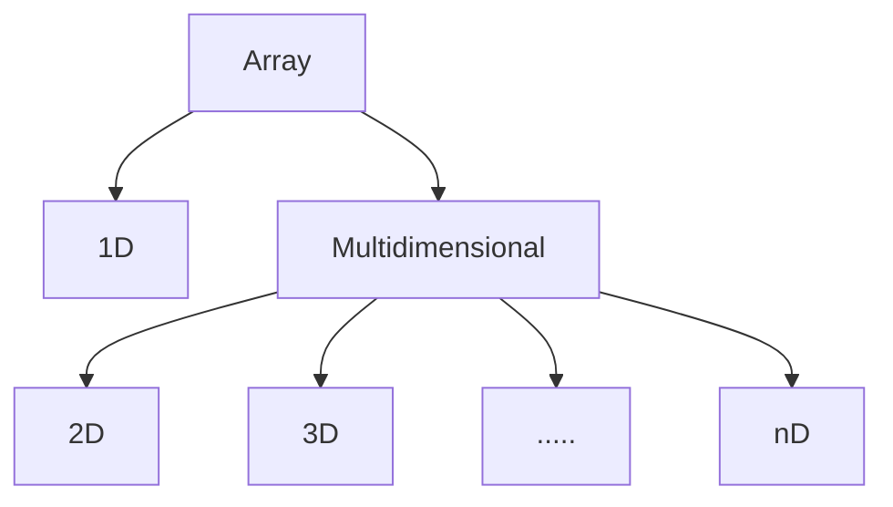

# Arrays

| Content |
| :-------- |
| [Introduction](#introduction) |
| [Why do we need an array?](#why-do-we-need-an-array) |
| [Types of Array](#types-of-array) |
| [Array in Memory](#array-in-memory) |
| [Create an Array](#create-an-array) |
| [Insertion Operation](#insertion-operation) |
| [Traversal Operation](#traversal-operation) |
| [Accessing an Element of Array](#accessing-an-element-of-array) |
| [Searching an Element of Array](#searching-an-element-in-array) |
| [Deletion Operation](#deletion-operation) |
| [Time & Space Complexity of 1D & 2D array](#time--space-complexity-of-1d--2d-array) |
| [When to use/avoid array](#when-to-useavoid-array) |
| [Problems](#problems) |

## Introduction

Let's take an example to understand array. If you have ever seen a box of ties, you have found a box in which small compartments are there to contain ties. So,

- Box of ties.
- All the compartments are contiguous.
- Each compartment can be identified uniquely.
- Size of the box is fixed and cannot be modified (as they come from the standard manufacturer).

Arrays can be considered similar to box of ties,

- It can store data of specified data type.
- It has contiguous memory location.
- Every cell of an array has an unique 'index'.
- Index starts with 0.
- Size of an array needs to be specified and cannot be modified.

So, to define array, it is a collection of items stored at contiguous memory locations. The idea is to store multiple items of the same type together. This makes it easier to calculate the position of each element by simply adding an offset to a base value, i.e., the memory location of the first element of the array (generally denoted by the name of the array).

```
[10, 20, 30, 40, 50, 60]
  |   |   |   |   |   |
  0   1   2   3   4   5
```

## Why do we need an Array?

**Problem Statement**

We want to store 1 million similar datatype in memory.

**Solution - 1**

We declare 1 million primitive datatype structure like integer, float, character, boolean.

*Issue - How do we maintain such a large list of variable?*

**Solution - 2**

We declare an array of size 1 million.

*Advantage - We just need to reference the cell number of the array & we can access the cell.*

## Types of Array



### One Dimensional Array

In it each element is represented by a single subscript. The elements are stored in consecutive memory location.

a[i] --> i between 0 to n

```
[10, 20, 30, 40, 50, 60]
  |   |   |   |   |   |
  0   1   2   3   4   5
```

To know more about types of array, refer below link(s):

- [Types of Arrays - CSVEDA](https://csveda.com/data-structure/types-of-arrays/)

## Array in Memory

Let's start with 1D array.

Suppose we have initiated 1D array which has 10 elements in it.

```
arr[10] = [1, 2, 3, 4, 5, 6, 7, 8, 9, 10]
```

Below is the representation of this array stored in memory(RAM). (This representation is only for understanding purposes)

|  |  |  |  |  |  |  |
| --- | --- | --- | --- | --- | --- | --- |
|  |  |  |  |  |  |  |
|  |  |  |  |  |  |  |
|  |  |  |  |  |  |  |
|  |  |  |  |  |  |  |
|  |  |  |  |  |  |  |
| 1 | 2 | 3 | 4 | 5 | 6 | 7 |
|  |  |  |  |  |  |  |
|  |  |  |  |  |  |  |
|  |  |  |  |  |  |  |
|  |  |  |  |  |  |  |
|  |  |  |  |  |  |  |
|  |  |  |  |  |  |  |

Now, when we instantiate an array of 'n' size, compiler allocates 'n' continuous cells in RAM. Please note that allocation of cells can be start from anywhere in RAM, it is not under programmer's hand but it guarantees that all these cells will be in continuos memory location.

Let's see this case in 2D array,

```
arr[5][2] = [[0, 10], [20, 30], [40, 50], [60, 70], [80, 90]]
```

In RAM, it will not store like below:

|  |  |
| --- | --- |
|  |  |
|  |  |
|  |  |
| 0 | 10 |
| 20 | 30 |
| 40 | 50 |
| 60 | 70 |
| 80 | 90 |
|  |  |
|  |  |
|  |  |
|  |  |
|  |  |

However, it will store in the same manner as seen in 1D array case,

|  |  |  |  |  |  |  |  |  |  |
| --- | --- | --- | --- | --- | --- | --- | --- | --- | --- |
|  |  |  |  |  |  |  |  |  |  |
|  |  |  |  |  |  |  |  |  |  |
|  |  |  |  |  |  |  |  |  |  |
|  |  |  |  |  |  |  |   |  |  |
|  |  |  |  |  |  |  |  |  |  |
| 0 | 10 | 20 | 30 | 40 | 50 | 60 | 70 | 80 | 90 |
|  |  |  |  |  |  |  |  |  |  |
|  |  |  |  |  |  |  |  |  |  |
|  |  |  |  |  |  |  |  |  |  |
|  |  |  |  |  |  |  |  |  |  |
|  |  |  |  |  |  |  |  |  |  |
|  |  |  |  |  |  |  |  |  |  |

Same goes for 3D and so on.

Readings:

- [CSE Engineering - NYU](https://cse.engineering.nyu.edu/~mleung/CS1114/f07/ch07/memory.htm)

## Create an Array

Creating an array basically involves below steps:

***Declare***

During declaration, we create a reference to array

***Instantiation***

During instantiation, we,

- define the datatype of elements that it will store and
- define it's size (the maximum number of elements)

***Initialization***

During initialization, we assign values to cells in array.

|  |  |  |  |  |  |  |
| --- | --- | --- | --- | --- | --- | --- |
|  |  |  |  |  |  |  |
|  |  |  |  |  |  |  |
|  |  |  |  |  |  |  |
|  |  |  |  |  |  |  |
|  |  |  |  |  |  |  |
|  | x102 | --> | 4 | 5 | 6 | 7 |
|  | arr |  | x102+0 | x102+1 | x102+2 | x102+3 |
|  |  |  |  |  |  |  |
|  |  |  |  |  |  |  |
|  |  |  |  |  |  |  |
|  |  |  |  |  |  |  |
|  |  |  |  |  |  |  |

- Once we declare array, system does not allocate memory location to it. It only creates a reference variable, Let's say, our reference variable is 'arr' which is name of an array.

- During the instantiation, compiler allocates memory to the array. After that, it stores the address of first cell in the reference variable. For instance, if the address of first cell is 'x102' then it will store the same in reference variable 'arr' and with that a link is created between 'arr' and first cell of array.

  At memory level, when we are pointing at the first cell of array, then we are saying x102 + 0, but why + 0 ?

  Because every time we want to go to the next cell, we have to increment this number from 0, 1, 2 and so on. But, for first cell there is no need for increment and that's why + 0. ***This is the reason why we start indexing of array from 0***

- During initialization, array cells are initialized with the given value (in Java, compiler gives 0 as default value to each cell of array).

So,

***Declare***

**1D**

```
datatype []arr ---> O(1)
eg. int []arr
```

**2D**

```
datatype [][]arr ---> O(1)
eg. int [][]arr
```

***Instantiation***

**1D**

```
array_reference_var = new datatype[size] ---> O(1)
eg. arr = new int[5]
```

**2D**

```
array_reference_var = new datatype[row][col] ---> O(1)
eg. arr = new int[2][3]
```

***Initialization***

**1D**

```
arr[0] = 10; ---> O(1)
arr[1] = 20; ---> O(1)
arr[2] = 30; ---> O(1)
```

total TC would O(n)

**2D**

```
arr[0][0] = 10; ---> O(1)
arr[0][1] = 20; ---> O(1)
arr[0][2] = 30; ---> O(1)
arr[1][0] = 40; ---> O(1)
arr[1][1] = 50; ---> O(1)
arr[1][2] = 60; ---> O(1)
```

total TC would O(mn)

Combining all three steps:

**1D**

```
int arr[] = {10, 20, 30} ---> O(1)
```

**2D**

```
int arr[][] = {{10, 20, 30}, {40, 50, 60}} ---> O(1)
```

## Insertion Operation

**1D**

```
insert(arr, value_to_be_inserted, location):
    if (arr[location] is occupied) ---> O(1)
        current_element = arr[location]
        arr[location] = value_to_be_inserted
        loop: i=location+1 to arr.length ---> O(n)
            next_element = arr[i] ---> O(1)
            arr[i] = current_element ---> O(1)
            current_element = next_element ---> O(1)
    else ---> O(1)
        arr[location] = value_to_be_inserted ---> O(1)
```

Time Complexity = O(1)(Best) & O(n)(Worst)

Space Complexity = O(1)

**2D**

In 2D array, insertion is different than 1D array, because here we cannot insert a single value and rather, we need to insert row or column, let's imagine that we have an 2D array and we are adding a single element, then what would be the value of next 2 rows? (See below example)

|   |   |   |   |   |   |
| - | - | - | - | - | - |
|   |   |   |   |   |   |
|   | 1 | 10| 11| 3 |   |
|   | 5 | 6 | 1 | ? |   |
|   | 1 | 7 | 8 | ? |   |
|   |   |   |   |   |   |
|   |   |   |   |   |   |
|   |   |   |   |   |   |

We cannot leave the rest of rows empty because then it is not going to be two dimensional array. The system will recognize this array separately as one dimensional array. *The format of a two dimensional array must be in matrix format.*

So how can we add new value to the two dimensional array?

There are two different ways of adding elements in two dimensional array. The first one is addition of columns, and the second one is additional of rows.

*Column Insertion*

```
insert(arr, col_to_be_inserted, location):
    if col_to_be_inserted is not last column ---> O(1)
        loop: row=0 to rows ---> O(m)
            current_element = col_to_be_inserted[row] ---> O(1)
            loop: col=location to cols ---> O(n)
                next_element = arr[row][col] ---> O(1)
                arr[row][col] = current_element ---> O(1)
                current_element = next_element ---> O(1)
    else ---> O(1)
        loop: row=0 to rows ---> O(m)
            arr[row][rows.length] = col_to_be_inserted[row] ---> O(1)
```

Time Complexity = O(m)(Best) & O(mn)(Worst)

Space Complexity = O(1)

*Row Insertion*

```
insert(arr, row_to_be_inserted, location):
    if row_to_be_inserted is not last row ---> O(1)
        current_row = row_to_be_inserted ---> O(1)
        loop: row=location to rows ---> O(m)
            next_row = arr[row] ---> O(1)
            arr[row] = current_row ---> O(1)
            current_row = next_row ---> O(1)
    else ---> O(1)
        arr[location] = row_to_be_inserted ---> O(1)
```

Time Complexity = O(1)(Best) & O(m)(Worst)

Space Complexity = O(1)(Best) & O(m)(Worst)

## Traversal Operation

Traversing means visiting all the cells of array.

**1D**

```
traverse_array(arr):
    loop: i=0 to arr.length ---> O(n)
        print arr[i] ---> O(1)
```

Time Complexity = O(n)

Space Complexity = O(1)

**2D**

```
traverse_array(arr):
    loop: row=0 to rows ---> O(m)
        loop: col=0 to cols ---> O(n)
            print arr[row][col] ---> O(1)
```

Time Complexity = O(mn)

Space Complexity = O(1)

## Accessing an Element of Array

An element of an array can be accessed using it's index value.

**1D**

```
accessing_cell(arr, index):
    if index > length of array ---> O(1)
        return exception ---> O(1)
    else ---> O(1)
        return arr[index] ---> O(1)
```

Time Complexity = O(1)

Space Complexity = O(1)

**2D**

```
accessing_cell(arr, row_num, col_num):
    if row_num OR col_num > arr.length ---> O(1)
        return exception  ---> O(1)
    else  ---> O(1)
        return arr[row_num][col_num] ---> O(1)
```

Time Complexity = O(1)

Space Complexity = O(1)

## Searching an Element in Array

**1D**

```
search_in_array(arr, value_to_search):
    loop: i=0 to arr.length ---> O(n)
        if arr[i] equals value_to_search ---> O(1)
            return i ---> O(1)
    return error //value not found ---> O(1)
```

Time Complexity = O(1)(Best) & O(n)(Worst)

Space Complexity = O(1)

**2D**

```
search_in_array(arr, value_to_search):
    loop: row=0 to rows ---> O(m)
        loop: col=0 to cols ---> O(n)
            if arr[row][col] equals value_to_search ---> O(1)
                return i ---> O(1)
    return error //value not found ---> O(1)
```

Time Complexity = O(1)(Best) & O(mn)(Worst)

Space Complexity = O(1)

## Deletion Operation

Let's say you want to delete an element which is not located at the last index of array. So, to maintain the efficiency of random access, the elements must be stored in continuous space of memory in the array. This means you cannot just delete this element from here and leave any space empty. This is not allowed here because in this case, we are losing the efficiency of accessing elements of the array using index. Rather, after deleting the given element, we will shift/move next elements of array so that index of each elements after the deleted element will be reduced by 1.

**1D**

```
deleting_value_from_array(arr, value):
    index = -1 ---> O(1)
    loop: i=0 to arr.length ---> O(n)
        if arr[i] == value ---> O(1)
            index = i ---> O(1)
            break ---> O(1)
    if index == arr.length - 1 ---> O(1)
        arr[index] = null //or min value of array's datatype ---> O(1)
    else if index != -1 ---> O(1)
        //shift all elements from location+1 by one position to the left by -1
        loop: i=index to arr.length - 1 ---> O(n)
            arr[i] = arr[i+1] ---> O(1)
    else ---> O(1)
        return error //element not found ---> O(1)
```

Time Complexity = O(1)(Best) & O(n)(Worst)

Space Complexity = O(1)

**2D**

In 2D array, just like insertion operation, deletion operation can occur at column and row level

*Column Deletion*

```
deleting_col_from_array(arr, col_index):
    if col_index != last_column ---> O(1)
        loop: row=0 to rows ---> O(m)
            loop: col=col_index to cols - 1 ---> O(n)
                arr[row][col]=arr[row][col+1] ---> O(1)
    else
        loop: row=0 to rows ---> O(m)
            arr[row][col_index] = null ---> O(1)
```

Time Complexity = O(m)(Best) & O(mn)(Worst)

Space Complexity = O(1)

*Row Deletion*

```
deleting_row_from_array(arr, row_index):
    if row_index != last_row ---> O(1)
        loop: row=row_index to rows-1 ---> O(m)
            arr[row] = arr[row+1] ---> O(1)
    else ---> O(1)
        arr[row_index] = null ---> O(1)
```

Time Complexity = O(1)(Best) & O(m)(Worst)

Space Complexity = O(1)

## Time & Space Complexity of 1D & 2D array

| Operations | 1D Array|| 2D Array ||
| ----| ---- |---- | ---- |---- |
| | **TC** | **SC** | **TC** | **SC** |
| Creating an empty array | O(1) | O(n) | O(1) | O(mn)|
| Inserting a value in an array | Best - O(1)<br/>Worst - O(n) | O(1) | Column Insertion<br/>Best - O(m)<br/>Worst - O(mn)<br/><br/>Row Insertion<br/>Best - O(1)<br/>Worst - O(m) | Column Insertion<br/>Best - O(1)<br/><br/>Row Insertion<br/>Best - O(1)<br/>Worst - O(m)|
| Traversing an array | O(n) | O(1) | O(mn) | O(1) |
| Accessing a given cell | O(1) | O(1) | O(1) | O(1) |
| Searching a given value | O(1)/O(n) | O(1) | O(1)/O(mn) | O(1) |
| Deleting a given value | O(1)/O(n) | O(1) | Column Insertion<br/>Best - O(m)<br/>Worst - O(mn)<br/><br/>Row Insertion<br/>Best - O(1)<br/>Worst - O(m) | Column Insertion<br/>Best - O(1)<br/><br/>Row Insertion<br/>Best - O(1) |

## When to use/avoid array

**When to use**

- To store multiple variables of same data type
- Random Access

**When to avoid**

- Data to be stored is non-homogenous.
- Reserves memory - Maybe array reserves a memory that will not be used in the future, but it takes a memory in our RAM. This also causes another problem when you add elements to an array and array begins to exceed its reserves capacity. In this case, the array allocates a larger region of memory and copies its elements into the new storage, this in turn, affects the performance.

