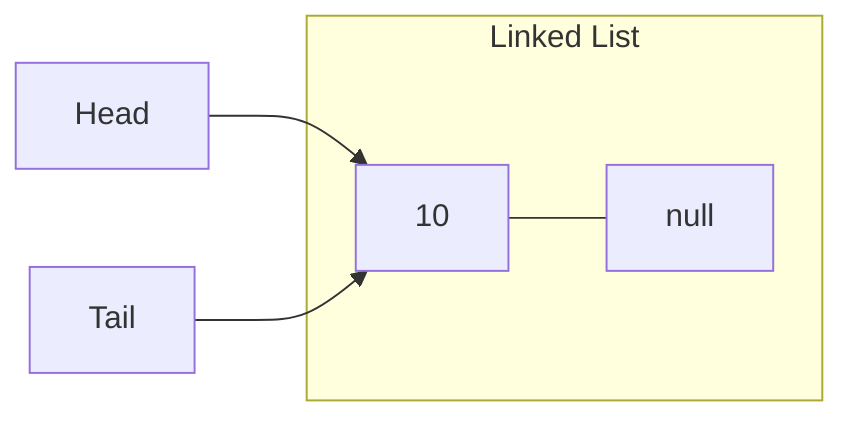
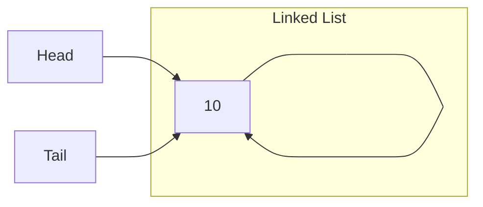

# Linked Lists

| Content |
| :-------- |
| [Introduction](#introduction) |
| [Linked List vs Array](#linked-list-vs-array) |
| [Types of Linked List](#types-of-linked-list) |
| [Why so many types of Linked List?](#why-so-many-types-of-linked-list) |
| [How is linked list stored in memory?](#how-is-linked-list-stored-in-memory) |
| [Operations in Single Linked List](#operations-in-single-linked-list) |
| [Operations in Circular Single Linked List](#operations-in-circular-single-linked-list) |

## Introduction

A linked list is a linear data structure where each element is a separate object. We can call it as **Node**. Each node of a linked list comprises of 2 items - the data and a reference to the next node. 

The most powerful feature of linked list is that it is of variable size.

Let's understand this with a ***Train*** example:


**Observations**

- We know that in train, we have engine which pulls the compartment attached to it. In above representation, there is 1 engine pulling compartment and 1 guard room at the end.

- Train always starts with engine. It cannot be start from compartment or guard room.

- Guard room is always present at the end train. It cannot be in middle or at the start of train.

- All the compartments are joined with engine or each other with the help of couplers.

- In a compartment, we have seats for passengers.

- All of these compartments are independent. Means, if we add or remove compartment for various reasons, train will still be operable.

- Important thing is that compartment are in sequential manner. So, if there is a need to go from 1st to last compartment, we cannot jump directly to the last one. We need to first to go through 1, 2 and so on until we reach the last compartment.

Now, let's compare Train analogy with Linked List:

- Head of a linked list is similar to train's engine. It stores the reference to the first node.

- Each node of a linked list is a separate object just like train's compartment.

- A node comprises of 2 things - **Data** & **Reference of next node** where data can be compared with the passengers inside compartment and reference of next node can be compared with couplers.

- Just like train's compartment, node of linked can be added or removed.

- Tail of a linked list is similar to train's guard room. It stores the reference to the last node of the list.

Below is the logical representation of Linked List:


> Why there is a need to store last address separately or the need of the tail?
>
> People will say that we can start from the head and traverse through the linked list till the last node. Then, what is the purpose of storing reference of last node. The answer to that is, let's say, we want to add node to a current list, if start from the first node & traverse till last node (as random access is not possible in linked list), it will take O(n) TC unnecessarily. However, if we store last reference address,i.e., tail, we can link new node at last position in linked list in O(1) TC. However, it is not mandate that every time, you need to maintain tail. But to improve time efficiency, it is a good practice.

## Linked List vs Array

| | Array | Linked List |
| -- | -- | -- |
| Basic | An array is the DS contains a collection of similar type data elements. | It is considered as non-primitive DS contains a collection of unordered linked elements known as Nodes. |
| Accessing the element | In the array, elements belongs to indexes, i.e., if you want to get the 4th element, you have to write variable name with its index or location within the square bracket. | In linked list though, you have to start from the head and work your way through until you get to the 4th element. |
| Speed of accessing the element | Accessing an element in array is fast. | Linked list takes linear time so, it is bit slower. |
| Insertion & Deletion of element | Insertion and deletion operation in array consumes time. | Performance of these operations in linked list is fast. |
| Size | Arrays are of fixed size | Linked list are dynamic & flexible and can expand and contract it's size. |
| Storage Allocation | In an array, memory is assigned during compile. | In a linked list, it is allocated during execution or runtime. |
| Order of elements | Elements are stored consecutively in arrays. | Elements are stored randomly in linked lists. |
| Memory required | The requirements of memory is less due to the actual data being stored  within the index in the array. | There is a need for more memory in linked list due to the storage of additional next & previous reference elements. |
| Memory utilization | Memory utilization is inefficient in array. | It is efficient in linked list. |
| Searching | Binary & Linear search | Linear search |

## Types of Linked List

There are 4 types of linked list:

- Single Linked List

- Circular Single Linked List

- Double Linked List

- Circular Double Linked List

### Single Linked List

In this, each node stores the data of the node and a reference to the next node in the list. It does not store any reference to the previous node.


### Circular Single Linked List

It is same as singly linked list except the last node of it also contains the reference to the first node.


### Double Linked List

In double linked list, each node contains 2 references, reference to the next as well as previous node.


### Circular Double Linked List

It is similar to doubly linked list except the last node contains reference to the first node and first node contains reference to the last node.


## Why so many types of Linked List?

### Circular Single Linked List

In most basic form, linked list gives the flexibility to add or remove nodes during runtime. Let's see a scenario where single linked list face limitations.

Suppose, 4 people playing a board game in which everyone gets their turns once previous player finishes his/her. With single linked list, player 1 starts, once he/she is done, player 2 turn will come and so on. However, as soon as, player 4 will finish his/her turn. Control or turn will not go to the player 1 as in single linked list, no reference is stored of any kind.

To solve this, circular single linked list can be used so that, once, player 4 turns get over, player 1 can get his/her turn again. This loop keeps on until any player is declared winner.

### Double Linked List

Let's say, we want to implement a music player which has next & previous button such that as soon as you click on next button, we should have access to next song of playlist & same goes with previous button.

With single linked list, it is not possible as it does not store the reference of previous and next nodes. Therefore, double linked list is perfect for such scenarios.

### Circular Double Linked List

Let's say, we want to implement a functionality to switch between applications from any place. You can compare with Windows' "Alt + Tab" button press such that, if you are working with 5 different apps in your PC and want to switch to specific app, you can press "Alt+Tab" and choose your desired one.

This kind of feature cannot be implemented with single linked list and with double linked list, it will fail in case when you are at last app and want to choose app stacked at first place. Therefore, in this scenario, circular double linked list works as a perfect contender.

## How is linked list stored in memory?


In array, if you remember, as soon as we instantiated the array, contiguous memory is allocated with similar to the size of array. In linked list, it is not like that. In above figure, we have 5 elements and all are located separately in RAM. This is the power of linked list that we can create as many nodes as required at runtime which is not the case in array due to fixed size.

## Operations in Single Linked List

### Creation of Single Linked List

There are below steps involves in it:

- Create head and tail and initialize both with null as we don't have any node to store the reference of into in head and tail.

- Create blank node and initialize its reference with null indicating that it does not point to any other node and some data.

- Now, we have to link head & tail with this node. For that, we have to store the address of the node into the head and since we have only one node, we can update tail as well with the node's address.



```
singleLinkedList(NodeValue):
    create a head, tail pointer & initialize with null ---> O(1)
    create a blank node ---> O(1)
    node.value = NodeValue ---> O(1)
    head = node ---> O(1)
    tail = node ---> O(1)
```

Time Complexity = O(1)

Space Complexity = O(1)

### Insertion in Single Linked List

There are 3 cases of insertion:

1. Insert at the start of linked list

    To add a node at the beginning of a linked list, we will first create a blank node, then update the data in it. In it's reference, we will store the address consist in the head and in head, we will add the address of this newly created node.

    

2. Insert at the end of linked list

    To add a node at the beginning of a linked list, we will first create a blank node, then update the data in it. In it's reference, we will update null. Now, to create the link between this new node and the current last node of linked list, we will update the address of current last node from null to new node address and then update the tail with the new node address.

    

3. Insert at the specified location in linked list

    To add a node at a specified location, we will first create a blank node, update the required data in it and then loop till we reach one node before specified location. Afterwards, in located node, we will update it's reference address into new node reference pointer and in located node, we will update the new node address.

    

```
insertLinkedList(head, tail, nodeValue, location):
    create a blank node ---> O(1)
    node.value = nodeValue ---> O(1)
    if !existsLinkedList(head) ---> O(1)
        return error // linked list does not exists ---> O(1)
    else if location equals 0 // insert at first position ---> O(1)
        node.next = head ---> O(1)
        head = node ---> O(1)
    else if location equals last // insert at last position ---> O(1)
        node.next = null ---> O(1)
        tail.next = node ---> O(1)
        tail = node ---> O(1)
    else // insert at specified position
        tempNode=head
        loop: counter=1 to location-1 ---> O(n)
            tempNode=tempNode.next ---> O(1)
        node.next = tmpNode.next
        tmpNode.next = node
```

Time Complexity = O(1)(Best) & O(n)(Worst)

Space Complexity = O(1)

### Transversal of Single Linked List

```
transversalLinkedList(head):
    if head == null, then return ---> O(1)
    n = head ---> O(1)
    loop: n.next is not null ---> O(n)
        print(n.data) ---> O(1)
```

Time Complexity = O(n)

Space Complexity = O(1)

### Searching a node in Single Linked List

In linked list, to search for an element, you need to traverse until that element is found.

```
searchNode(head, nodeValue):
    n = head ---> O(1)
    loop: n.next is not null ---> O(n)
        if n.data equals nodeValue ---> O(1)
            return True ---> O(1)
        n = n.next ---> O(1)
    return False ---> O(1)
```

Time Complexity = O(n)

Space Complexity = O(1)

### Deletion of node from Single Linked List

There can be 3 cases:

1. Delete first node

    To delete first node:

    - First check if the node to be deleted is the not the only node in the list. If not, then we have to update tail & head as null.

    - If the linked list has more than 1 node, then in head, we will update the address of 2nd node.


2. Delete last node

    To delete last node:
    
    - If the last node needs to be deleted is the only node, then just update head and tail as null.

    - If there are more than 1 node, then keep looping till the second last node and update it's reference as null and also update tail with second last node's address.


3. Deleting any node except for first and last

    In this case, we start looping until we reach the node which is immediately before the node we want to delete. Afterwards, we have to update this node's reference with the address contain in node to be deleted.


```
deletingNode(head, tail, location):
    if !existsLinkedList(head) ---> O(1)
        return error // linked list does not exists ---> O(1)
    else if location equals 0 // delete first node ---> O(1)
        head = head.next ---> O(1)
        if head is null ---> O(1)
            tail = null ---> O(1)
    else if location equals last // delete last node ---> O(1)
        if head.next is null ---> O(1)
            head = null ---> O(1)
            tail = null ---> O(1)
        else: ---> O(1)
            n = head ---> O(1)
            loop: n.next.next is not null ---> O(n)
                n = n.next ---> O(1)
            tail = n ---> O(1)
            n.next = null ---> O(1)
    else // delete node at specified position ---> O(1)
        tempNode=head ---> O(1)
        loop: counter=1 to location-1 ---> O(n)
            tempNode=tempNode.next ---> O(1)
        tmpNode.next = tmpNode.next.next ---> O(1)
        tmpNode.next.next = null ---> O(1)
```

Time Complexity = O(1)(Best) & O(n)(Worst)

Space Complexity = O(1)

### Delete Entire Single Linked List

To delete entire single linked list, all that we have to do is to disconnect head from the first node. In that way, if nothing is pointing to first node, then it will automatically eligible for garbage collection. Once, first node is deleted then nothing is pointing to second node, it will also get deleted during garbage collection and so on.

However, when it comes to last node which is pointed by tail, due to which it will not get deleted. Therefore, along with head, update tail also with null and then last node will also get deleted during garbage collection.

```
deleteLinkedList(head, tail):
    head = null ---> O(1)
    tail = null ---> O(1)
```

Time Complexity = O(1)

Space Complexity = O(1)

### Reversing Single Linked List

Reverse operation in linked list is basically swapping reference variable of adjacent nodes each other.


Follow the steps below to reverse single linked list

- Initialize three pointers prev as null, curr as head, and next as null.

- Iterate through the linked list. In a loop, do the following:

    - Before changing the next of curr, store the next node

        ```
        next = curr.next
        ```

    - Now update the next pointer of curr to the prev 

        ```
        curr.next = prev
        ```

    - Update prev as curr and curr as next

        ```
        prev = curr
        curr = next
        ```

```
reverseSingleLinkedList(head):
    if head is null
        return
    prev = null ---> O(1)
    curr = head ---> O(1)
    next = null ---> O(1)
    loop: curr.next is not null ---> O(n)
        next = curr.next ---> O(1)
        curr.next = prev ---> O(1)
        prev = curr ---> O(1)
    head = prev ---> O(1)
    return head ---> O(1)
```

Time Complexity = O(n)

Space Complexity = O(1)

### Time and Space Complexity of Single Linked List

| Operations | Time Complexity | Space Complexity |
| :--- | :--- | :--- |
| Creation | O(1) | O(1) |
| Insertion | Best - O(1)<br/>Worst - O(n) | O(1) |
| Search | Best - O(1)<br/>Worst - O(n) | O(1) |
| Traversal | O(n) | O(1) |
| Delete | Best - O(1)<br/>Worst - O(n) | O(1) |
| Deleting Linked List | O(1) | O(1) |
| Reverse | O(n) | O(1) | 

## Operations in Circular Single Linked List

### Creation of circular single linked list

- First of all, create head, tail and blank node.

- Insert value in node.

- In node's reference variable, update node's address itself.



```
createCircularLinkedList(nodeValue):
    create a blank node ---> O(1)
    node.value = nodeValue ---> O(1)
    node.next = node ---> O(1)
    head = node ---> O(1)
    tail = node ---> O(1)
```

Time Complexity = O(1)

Space Complexity = O(1)

### Insertion in Circular Single Linked List

There can be 3 cases:

1. Insert at the start of linked list

    To add node at the beginning of linked list, create a blank node and initialize it with data. Assign it's reference variable with the address stored in head and in head update this node address. Afterwards, update the reference variable of last node with the new node address.

    

2. Insert at the end of linked list

    Crete a new node, initialize it with data. Go to the last node, assign new node's reference variable with the address stored in last node's reference variable and in last node's reference variable, assign new node's address. Also, update tail with new node address.

    

3. Insert at the specified location

    This is similar to what we have discussed in single linked list case.

```
insertCircularSingleLinkedList(head, tail, nodeValue, location):
    create a blank node ---> O(1)
    node.data = nodeValue ---> O(1)
    if !existLinkedList(head) ---> O(1)
        return error // linked list does not exist ---> O(1)
    else if location equals 0 ---> O(1)
        node.next = head ---> O(1)
        head = node ---> O(1)
        tail.next = head ---> O(1)
    else if location equals last ---> O(1)
        node.next = head ---> O(1)
        tail.next = node ---> O(1)
        tail = node ---> O(1)
    else: ---> O(1)
        n = head ---> O(1)
        loop: counter=1 to location-1 ---> O(n)
            n = n.next ---> O(1)
        node.next = n.next ---> O(1)
        n.next = node ---> O(1)
```

Time Complexity = O(1)(Best) & O(n)(Worst)

Space Complexity = O(1)

### Traversal of Circular Single Linked List

In circular single linked list, during traversing loop should end when reference variable of a node is equal to head. 

```
traversalCircularSingleLinkedList(head):
    if head is null; then return; ---> O(1)
    n = head ---> O(1)
    loop: n.next != head ---> O(n)
        print(n.data) ---> O(1)
```

Time Complexity = O(n)

Space Complexity = O(1)

### Searching a node in Circular Single Linked List

```
searchNode(head, nodeValue):
    n = head ---> O(1)
    loop: n.next != head ---> O(n)
        if n.data == nodeValue ---> O(1)
            return True ---> O(1)
        n = n.next ---> O(1)
    return False ---> O(1)
```

Time Complexity = O(1)(Best) & O(n)(Worst)

Space Complexity = O(1)

### Deleting a node in Circular Single Linked List

There can be 3 cases:

1. Delete first node

    To delete first node, update the address of second node into head and then update the second node address in last node's reference variable.

    

2. Delete last node

    To delete the last node, keep traversing until you find second last node. After that, update second last node's reference variable with head. Also, update tail address with the second last node's address.

    

3. Delete any node apart from 1st and last

    Similar to what we have seen in single linked list discussion.

```
deleteNodeInCircularSingleLinkedList(head, tail, location):
    if !existsLinkedList(head) ---> O(1)
        return error // linked list does not exists ---> O(1)
    else if location equals 0 // delete first node ---> O(1)
        head = head.next ---> O(1)
        tail.next = head
        if head.next is head ---> O(1)
            head = null ---> O(1)
            head.next = null ---> O(1)
            tail = null ---> O(1)
    else if location equals last // delete last node ---> O(1)
        if head.next is head ---> O(1)
            head = null ---> O(1)
            head.next = null ---> O(1)
            tail = null ---> O(1)
        else: ---> O(1)
            n = head ---> O(1)
            loop: n.next.next is not head ---> O(n)
                n = n.next ---> O(1)
            tail = n ---> O(1)
            n.next = head ---> O(1)
    else // delete node at specified position ---> O(1)
        tempNode=head ---> O(1)
        loop: counter=1 to location-1 ---> O(n)
            tempNode=tempNode.next ---> O(1)
        tmpNode.next = tmpNode.next.next ---> O(1)
        tmpNode.next.next = null ---> O(1)
```

Time Complexity = O(1)(Best) & O(n)(Worst)

Space Complexity = O(1)

### Deleting entire Circular Single Linked List

To delete entire circular single linked list, update head, tail and circular reference to first node as null.

```
deleteCircularSingleLinkedList(head, tail):
    head = null ---> O(1)
    tail.next = null ---> O(1)
    tail = null ---> O(1)
```

Time Complexity = O(1)

Space Complexity = O(1)

### Reversing Circular Single Linked List

```
reverseCircularSingleLinkedList(head):
    if head is null ---> O(1)
        return ---> O(1)
    prev = null ---> O(1)
    curr = head ---> O(1)
    next = curr.next ---> O(1)
    curr.next = prev ---> O(1)
    prev = curr ---> O(1)
    curr = next ---> O(1)
    loop: curr != head ---> O(n)
        next = curr.next ---> O(1)
        curr.next = prev ---> O(1)
        prev = curr ---> O(1)
        curr = next ---> O(1)
    head.next = prev ---> O(1)
    head = prev ---> O(1)
    return head ---> O(1)
```

Time Complexity = O(n)

Space Complexity = O(1)

### Time and Space Complexity of Circular Single Linked List

| Operations | Time Complexity | Space Complexity |
| :--- | :--- | :--- |
| Creation | O(1) | O(1) |
| Insertion | Best - O(1)<br/>Worst - O(n) | O(1) |
| Search | Best - O(1)<br/>Worst - O(n) | O(1) |
| Traversal | O(n) | O(1) |
| Delete | Best - O(1)<br/>Worst - O(n) | O(1) |
| Deleting Linked List | O(1) | O(1) |
| Reverse | O(n) | O(1) |
