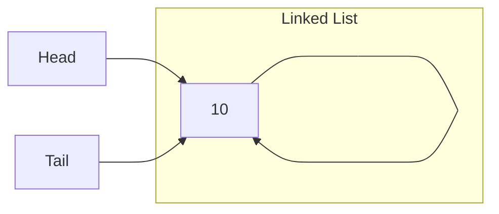

    loop: curr.next is not null ---> O(n)
        next = curr.next ---> O(1)
        curr.next = prev ---> O(1)
        prev = curr ---> O(1)
    head = prev ---> O(1)
    return head ---> O(1)
```

Time Complexity = O(n)

Space Complexity = O(1)

### Time and Space Complexity of Single Linked List

| Operations | Time Complexity | Space Complexity |
| :--- | :--- | :--- |
| Creation | O(1) | O(1) |
| Insertion | Best - O(1)<br/>Worst - O(n) | O(1) |
| Search | Best - O(1)<br/>Worst - O(n) | O(1) |
| Traversal | O(n) | O(1) |
| Delete | Best - O(1)<br/>Worst - O(n) | O(1) |
| Deleting Linked List | O(1) | O(1) |
| Reverse | O(n) | O(1) | 

## Operations in Circular Single Linked List

### Creation of circular single linked list

- First of all, create head, tail and blank node.

- Insert value in node.

- In node's reference variable, update node's address itself.



```
createCircularLinkedList(nodeValue):
    create a blank node ---> O(1)
    node.value = nodeValue ---> O(1)
    node.next = node ---> O(1)
    head = node ---> O(1)
    tail = node ---> O(1)
```

Time Complexity = O(1)

Space Complexity = O(1)

### Insertion in Circular Single Linked List

There can be 3 cases:

1. Insert at the start of linked list

    To add node at the beginning of linked list, create a blank node and initialize it with data. Assign it's reference variable with the address stored in head and in head update this node address. Afterwards, update the reference variable of last node with the new node address.

    

2. Insert at the end of linked list

    Crete a new node, initialize it with data. Go to the last node, assign new node's reference variable with the address stored in last node's reference variable and in last node's reference variable, assign new node's address. Also, update tail with new node address.

    

3. Insert at the specified location

    This is similar to what we have discussed in single linked list case.

```
insertCircularSingleLinkedList(head, tail, nodeValue, location):
    create a blank node ---> O(1)
    node.data = nodeValue ---> O(1)
    if !existLinkedList(head) ---> O(1)
        return error // linked list does not exist ---> O(1)
    else if location equals 0 ---> O(1)
        node.next = head ---> O(1)
        head = node ---> O(1)
        tail.next = head ---> O(1)
    else if location equals last ---> O(1)
        node.next = head ---> O(1)
        tail.next = node ---> O(1)
        tail = node ---> O(1)
    else: ---> O(1)
        n = head ---> O(1)
        loop: counter=1 to location-1 ---> O(n)
            n = n.next ---> O(1)
        node.next = n.next ---> O(1)
        n.next = node ---> O(1)
```

Time Complexity = O(1)(Best) & O(n)(Worst)

Space Complexity = O(1)

### Traversal of Circular Single Linked List

In circular single linked list, during traversing loop should end when reference variable of a node is equal to head. 

```
traversalCircularSingleLinkedList(head):
    if head is null; then return; ---> O(1)
    n = head ---> O(1)
    loop: n.next != head ---> O(n)
        print(n.data) ---> O(1)
```

Time Complexity = O(n)

Space Complexity = O(1)

### Searching a node in Circular Single Linked List

```
searchNode(head, nodeValue):
    n = head ---> O(1)
    loop: n.next != head ---> O(n)
        if n.data == nodeValue ---> O(1)
            return True ---> O(1)
        n = n.next ---> O(1)
    return False ---> O(1)
```

Time Complexity = O(1)(Best) & O(n)(Worst)

Space Complexity = O(1)

### Deleting a node in Circular Single Linked List

There can be 3 cases:

1. Delete first node

    To delete first node, update the address of second node into head and then update the second node address in last node's reference variable.

    

2. Delete last node

    To delete the last node, keep traversing until you find second last node. After that, update second last node's reference variable with head. Also, update tail address with the second last node's address.

    

3. Delete any node apart from 1st and last

    Similar to what we have seen in single linked list discussion.

```
deleteNodeInCircularSingleLinkedList(head, tail, location):
    if !existsLinkedList(head) ---> O(1)
        return error // linked list does not exists ---> O(1)
    else if location equals 0 // delete first node ---> O(1)
        head = head.next ---> O(1)
        tail.next = head
        if head.next is head ---> O(1)
            head = null ---> O(1)
            head.next = null ---> O(1)
            tail = null ---> O(1)
    else if location equals last // delete last node ---> O(1)
        if head.next is head ---> O(1)
            head = null ---> O(1)
            head.next = null ---> O(1)
            tail = null ---> O(1)
        else: ---> O(1)
            n = head ---> O(1)
            loop: n.next.next is not head ---> O(n)
                n = n.next ---> O(1)
            tail = n ---> O(1)
            n.next = head ---> O(1)
    else // delete node at specified position ---> O(1)
        tempNode=head ---> O(1)
        loop: counter=1 to location-1 ---> O(n)
            tempNode=tempNode.next ---> O(1)
        tmpNode.next = tmpNode.next.next ---> O(1)
        tmpNode.next.next = null ---> O(1)
```

Time Complexity = O(1)(Best) & O(n)(Worst)

Space Complexity = O(1)

### Deleting entire Circular Single Linked List

To delete entire circular single linked list, update head, tail and circular reference to first node as null.

```
deleteCircularSingleLinkedList(head, tail):
    head = null ---> O(1)
    tail.next = null ---> O(1)
    tail = null ---> O(1)
```

Time Complexity = O(1)

Space Complexity = O(1)

### Reversing Circular Single Linked List

```
reverseCircularSingleLinkedList(head):
    if head is null ---> O(1)
        return ---> O(1)
    prev = null ---> O(1)
    curr = head ---> O(1)
    next = curr.next ---> O(1)
    curr.next = prev ---> O(1)
    prev = curr ---> O(1)
    curr = next ---> O(1)
    loop: curr != head ---> O(n)
        next = curr.next ---> O(1)
        curr.next = prev ---> O(1)
        prev = curr ---> O(1)
        curr = next ---> O(1)
    head.next = prev ---> O(1)
    head = prev ---> O(1)
    return head ---> O(1)
```

Time Complexity = O(n)

Space Complexity = O(1)

### Time and Space Complexity of Circular Single Linked List

| Operations | Time Complexity | Space Complexity |
| :--- | :--- | :--- |
| Creation | O(1) | O(1) |
| Insertion | Best - O(1)<br/>Worst - O(n) | O(1) |
| Search | Best - O(1)<br/>Worst - O(n) | O(1) |
| Traversal | O(n) | O(1) |
| Delete | Best - O(1)<br/>Worst - O(n) | O(1) |
| Deleting Linked List | O(1) | O(1) |
| Reverse | O(n) | O(1) |
