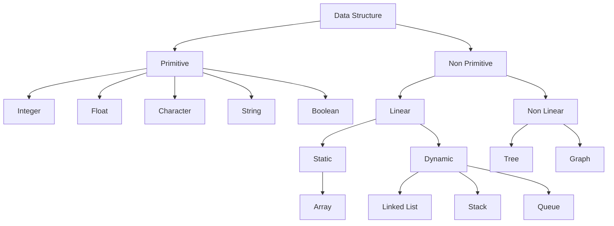

# CPP-Data-Structures-and-Algorithms-Introduction

| Content |
| :------ |
| [What is Data Structure?](#what-is-data-structure) |
| [What is an Algorithm?](#what-is-an-algorithm) |
| [Why are Data Structure and Algorithms important?](#why-are-data-structure-and-algorithms-important) |
| [Algorithm Efficiency](#algorithm-efficiency) |
| [Space Complexity](#space-complexity) |
| [Time Complexity](#time-complexity) |
| [Best case, Average case, and Worst case](#best-case-average-case-and-worst-case) |
| [Θ Notation (theta)](#θ-notation-theta) |
| [Ω Notation](#ω-notation) |
| [Big O Notation](#big-o-notation) |
| [Big - O: Calculation of Time & Space Complexity](#big---o-calculation-of-time--space-complexity) |

## What is Data Structure?

Data structure is a storage that is used to store and organize data. It is a way of arranging data on a computer so that it can be accessed and updated efficiently.

OR

Data Structures are different ways of organizing data on your computer, that can be used effectively.



Readings:

- [Data Structures - GeeksForGeeks](https://www.geeksforgeeks.org/data-structures/)

- [What are Data Structures? - Programiz](https://www.programiz.com/dsa/data-structure-types)

- [What is Data Structure? - Scalar Topics](https://www.scaler.com/topics/data-structures/what-is-data-structure/)

## What is an Algorithm?

The word Algorithm means:

A set of rules to be followed in calculations or other problem-solving operations.

OR 

A procedure for solving a mathematical problem in a finite number of steps that frequently by recursive operations.

OR

Set of rules for a computer program to accomplish a task.

A good algorithm should promote:

- **Correctness:** An algorithm is said to be correct if for every set of input it halts with the correct output. If you are not getting the correct output for any particular set of input, then your algorithm is wrong.

- **Finiteness:** Generally, people ignore this but it is one of the important factors in algorithm evaluation. The algorithm must always terminate after a finite number of steps. For example, in the case of recursion and loop, your algorithm should terminate otherwise you will end up having a stack overflow and infinite loop scenario respectively.

- **Efficiency:** An efficient algorithm is always used. By the term efficiency, we mean to say that:

    - The algorithm should efficiently use the resources available to the system.

    - The computational time (the time taken to generate an output corresponding to a particular input) should be as less as possible.

    - The memory used by the algorithm should also be as less as possible. Generally, there is a trade-off between computational time and memory. So, we need to find if the time is more important than space or vice-versa and then write the algorithm accordingly.

Readings:

- [What is Algorithm | Introduction to Algorithms - GeeksForGeeks](https://www.geeksforgeeks.org/introduction-to-algorithms/)

- [What is an Algorithm? - Programiz](https://www.programiz.com/dsa/algorithm)

- [Time and Space Complexity Analysis of Algorithm - AfterAcademy](https://afteracademy.com/blog/time-and-space-complexity-analysis-of-algorithm/)

## Why are Data Structure and Algorithms important?

Data structure and algorithms are two of the most important aspects of computer science. Data structures allow us to organize and store data, while algorithms allow us to process that data in a meaningful way. Learning data structure and algorithms will help you become a better programmer. You will be able to write code that is more efficient and more reliable. You will also be able to solve problems more quickly and more effectively.

## Algorithm Efficiency

So, we have seen above the three factors that can be used to evaluate an algorithm. Out of these three factors, the most important one is the *efficiency of algorithms*. So let's dive deeper into the efficiency of the algorithm.

The efficiency of an algorithm is mainly defined by two factors i.e. space and time. A good algorithm is one that is taking less time and less space, but this is not possible all the time. There is a trade-off between time and space. If you want to reduce the time, then space might increase. Similarly, if you want to reduce the space, then the time may increase. So, you have to compromise with either space or time. Let's learn more about space and time complexity of algorithms.

## Space Complexity

Space Complexity of an algorithm denotes the total space used or needed by the algorithm for its working, for various input sizes. For example:

```
def create_array(n):
    arr = []
    for i in range(n):
        arr.append(i)
```

In the above example, function **create_array** is creating an array of size **n**. So the space complexity of the above code is in the order of "n" i.e. if n will increase, the space requirement will also increase accordingly.

Even when you are creating a variable then you need some space for your algorithm to run. All the space required for the algorithm is collectively called the Space Complexity of the algorithm.

> NOTE: In normal programming, you will be allowed to use 256MB of space for a particular problem. So, you can't create an array of size more 10^8 because you will be allowed to use only 256MB. Also, you can't create an array of size more than 10^6 in a function because the maximum space allotted to a function is 4MB. So, to use an array of more size, you can create a global array.

## Time Complexity

The time complexity is the number of operations an algorithm performs to complete its task with respect to input size (considering that each operation takes the same amount of time). The algorithm that performs the task in the smallest number of operations is considered the most efficient one.

> Input Size: Input size is defined as total number of elements present in the input. For a given problem we characterize the input size **n** appropriately. For example:
>
> Sorting problem: Total number of item to be sorted
>
> Graph Problem: Total number of vertices and edges
>
> Numerical Problem: Total number of bits needed to represent a number

The time taken by an algorithm also depends on the computing speed of the system that you are using, but we ignore those external factors and we are only concerned on the number of times a particular statement is being executed with respect to the input size. Let's say, for executing one statement, the time taken is 1sec, then what is the time taken for executing n statements, It will take n seconds.

Suppose you are having one problem and you wrote three algorithms for the same problem. Now, you need to choose one out of those three algorithms. How will you do that?

- One thing that you can do is just run all the three algorithms on three different computers, provide same input and find the time taken by all the three algorithms and choose the one that is taking the least amount of time. Is it ok? No, all the systems might be using some different processors. So, the processing speed might vary. So, we can't use this approach to find the most efficient algorithm.

- Another thing that you can do is run all the three algorithms on the same computer and try to find the time taken by the algorithm and choose the best. But here also, you might get wrong results because, at the time of execution of a program, there are other things that are executing along with your program, so you might get the wrong time.

**NOTE:** One thing that is to be noted here is that we are finding the time taken by different algorithms for the same input because if we change the input then the efficient algorithm might take more time as compared to the less efficient one because the input size is different for both algorithms.

So, we have seen that we can't judge an algorithm by calculating the time taken during its execution in a particular system. We need some standard notation to analyze the algorithm. ***We use Asymptotic notation to analyze any algorithm and based on that we find the most efficient algorithm. Here in Asymptotic notation, we do not consider the system configuration, rather we consider the order of growth of the input. We try to find how the time or the space taken by the algorithm will increase/decrease after increasing/decreasing the input size.***

There are three asymptotic notations that are used to represent the time complexity of an algorithm. They are:

- Θ Notation (theta)
- Big O Notation
- Ω Notation

Before learning about these three asymptotic notation, we should learn about the best, average, and the worst case of an algorithm.

## Best case, Average case, and Worst case

An algorithm can have different time for different inputs. It may take 1 second for some input and 10 seconds for some other input.

>For example: We have one array named " arr" and an integer " k ". we need to find if that integer " k " is present in the array " arr " or not? If the integer is there, then return 1 other return 0. Try to make an algorithm for this question.

The following information can be extracted from the above question:

- **Input:** Here our input is an integer array of size "n" and we have one integer "k" that we need to search for in that array.

- **Output:** If the element "k" is found in the array, then we have return 1, otherwise we have to return 0.

Now, one possible solution for the above problem can be linear search i.e. we will traverse each and every element of the array and compare that element with "k". If it is equal to "k" then return 1, otherwise, keep on comparing for more elements in the array and if you reach at the end of the array and you did not find any element, then return 0.

```
def search_k(arr, n, k):

    # for-loop to iterate with each element in the array
    for i in range(n):

        # check if ith element is equal to "k" or not
        if arr[i] == k: # return 1, if you find "k"
            return 1
    return 0 # return 0, if you didn't find "k"
```

Each statement in code takes constant time, let's say "C", where "C" is some constant. So, whenever you declare an integer then it takes constant time when you change the value of some integer or other variables then it takes constant time, when you compare two variables then it takes constant time. So, if a statement is taking "C" amount of time and it is executed "N" times, then it will take C*N amount of time. Now, think of the following inputs to the above algorithm that we have just written:

> NOTE: Here we assume that each statement is taking 1sec of time to execute.

- If the input array is [1, 2, 3, 4, 5] and you want to find if "1" is present in the array or not, then the if-condition of the code will be executed 1 time and it will find that the element 1 is there in the array. So, the if-condition will take 1 second here.

- If the input array is [1, 2, 3, 4, 5] and you want to find if "3" is present in the array or not, then the if-condition of the code will be executed 3 times and it will find that the element 3 is there in the array. So, the if-condition will take 3 seconds here.

- If the input array is [1, 2, 3, 4, 5] and you want to find if "6" is present in the array or not, then the if-condition of the code will be executed 5 times and it will find that the element 6 is not there in the array and the algorithm will return 0 in this case. So, the if-condition will take 5 seconds here.

As you can see that for the same input array, we have different time for different values of "k". So, this can be divided into three cases:

- **Best case:** This is the lower bound on running time of an algorithm. We must know the case that causes the minimum number of operations to be executed. In the above example, our array was [1, 2, 3, 4, 5] and we are finding if "1" is present in the array or not. So here, after only one comparison, you will get that your element is present in the array. So, this is the best case of your algorithm.

- **Average case:** We calculate the running time for all possible inputs, sum all the calculated values and divide the sum by the total number of inputs. We must know (or predict) distribution of cases.

- **Worst case:** This is the upper bound on running time of an algorithm. We must know the case that causes the maximum number of operations to be executed. In our example, the worst case can be if the given array is [1, 2, 3, 4, 5] and we try to find if element "6" is present in the array or not. Here, the if-condition of our loop will be executed 5 times and then the algorithm will give "0" as output.

So, we learned about the best, average, and worst case of an algorithm. Now, let's get back to the asymptotic notation where we saw that we use three asymptotic notation to represent the complexity of an algorithm i.e. Θ Notation (theta), Ω Notation, Big O Notation.

> NOTE: In the asymptotic analysis, we generally deal with large input size.

## Θ Notation (theta)

The Θ Notation is used to find the average bound of an algorithm i.e. it defines an upper bound and a lower bound, and your algorithm will lie in between these levels. So, if a function is g(n), then the theta representation is shown as Θ(g(n)) and the relation is shown as:

```
Θ(g(n)) = { f(n): there exist positive constants c1, c2 and n0
          such that 0 ≤ c1 * g(n) ≤ f(n) ≤ c2 * g(n) for all n ≥ n0 }
```

The above expression can be read as theta of g(n) is defined as set of all the functions f(n) for which there exists some positive constants c1, c2, and n0 such that c1*g(n) is less than or equal to f(n) and f(n) is less than or equal to c2*g(n) for all n that is greater than or equal to n0.

For example:

```
if f(n) = 2n² + 3n + 1
and g(n) = n²
then for c1 = 2, c2 = 6, and n0 = 1, we can say that f(n) = Θ(n²)
```

## Ω Notation

The Ω notation denotes the lower bound of an algorithm i.e. the time taken by the algorithm can't be lower than this. In other words, this is the fastest time in which the algorithm will return a result. Its the time taken by the algorithm when provided with its best-case input. So, if a function is g(n), then the omega representation is shown as Ω(g(n)) and the relation is shown as:

```
Ω(g(n)) = { f(n): there exist positive constants c and n0
          such that 0 ≤ cg(n) ≤ f(n) for all n ≥ n0 }
```

The above expression can be read as omega of g(n) is defined as set of all the functions f(n) for which there exist some constants c and n0 such that c*g(n) is less than or equal to f(n), for all n greater than or equal to n0.

```
if f(n) = 2n² + 3n + 1
and g(n) = n²
then for c = 2 and n0 = 1, we can say that f(n) = Ω(n²)
```

## Big O Notation

The Big O notation defines the upper bound of any algorithm i.e. you algorithm can't take more time than this time. In other words, we can say that the big O notation denotes the maximum time taken by an algorithm or the worst-case time complexity of an algorithm. So, big O notation is the most used notation for the time complexity of an algorithm. So, if a function is g(n), then the big O representation of g(n) is shown as O(g(n)) and the relation is shown as:

```
O(g(n)) = { f(n): there exist positive constants c and n0
          such that 0 ≤ f(n) ≤ cg(n) for all n ≥ n0 }
```

The above expression can be read as Big O of g(n) is defined as a set of functions f(n) for which there exist some constants c and n0 such that f(n) is greater than or equal to 0 and f(n) is smaller than or equal to c*g(n) for all n greater than or equal to n0.

```
if f(n) = 2n² + 3n + 1
and g(n) = n²
then for c = 6 and n0 = 1, we can say that f(n) = O(n²)
```

## Big - O: Calculation of Time & Space Complexity

Readings:

- [Big O: How to Calculate Time and Space Complexity](https://www.inoutcode.com/concepts/big-o/)
- [Space Complexity and Time Complexity](https://www.i2tutorials.com/design-and-analysis-of-algorithmsdaa-tutorial/daa-space-complexity-and-time-complexity/)
- [Big O notation - Data Structures & Algorithms Tutorial #2 | Measuring time complexity](https://www.youtube.com/watch?v=IR_S8BC8KI0&list=PLeo1K3hjS3uu_n_a__MI_KktGTLYopZ12&index=2)
